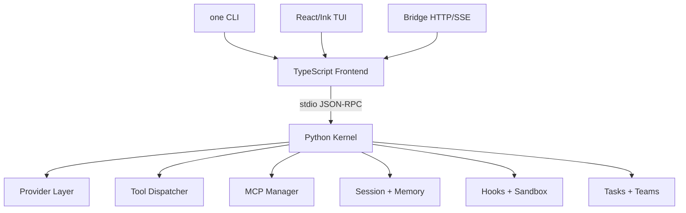

<h1 align="center"><code>one</code> — OneClaw: Agent Harness for Coding</h1>

<p align="center">
  <strong>Python kernel</strong> · <strong>TypeScript frontend</strong> · <strong>React/Ink TUI</strong> · <strong>MCP</strong> · <strong>Bridge control plane</strong>
</p>

**OneClaw** 是一个面向编程任务的 agent harness。它借鉴 OpenHarness 的分层方式，把 provider、query loop、tools、MCP、hooks、memory、session、sandbox、bridge 和 swarm/team 控制面拆成可维护的运行时模块。

当前仓库已经是新的 OneClaw 根项目。旧 CLI 历史仓保留在同级目录 `OneClaw-CLI`，本仓库只包含新的 harness runtime。

<p align="center">
  
  
  
  
  
</p>

## Start Here

```bash
bun install
bun run install:local
one --version
one ui
```

Run a one-shot prompt:

```bash
one -p "Inspect this repository and summarize the main runtime architecture"
```

Run the bridge control plane:

```bash
one bridge
```

Run the local verification suite:

```bash
bun run ci
```

## What Is OneClaw?

An agent harness is the infrastructure around an LLM that turns it into a usable coding agent. The model supplies reasoning; the harness supplies tools, memory, permissions, session state, UI, observability, and coordination.

OneClaw focuses on:

- **Agent loop**: streaming model calls, tool execution, session persistence, compaction, and event flow.
- **Tool platform**: file, shell, glob, edit, workspace status, todo, MCP tools, plugin tools, and permission checks.
- **Provider matrix**: subscription providers and compatible API providers under one runtime contract.
- **Context and memory**: project/session/global memory, context summaries, session export, and compaction policy.
- **Governance**: ask/allow/deny permissions, path and command controls, hooks, budget gates, and sandbox wrappers.
- **Bridge and swarm**: HTTP/SSE bridge, task runtime, team registry, roles, worktrees, review, and merge status.

## Architecture



## Provider Compatibility

| Provider | Purpose | Credential source |
|---|---|---|
| `codex-subscription` | Codex / ChatGPT subscription path | `~/.codex/auth.json` |
| `claude-subscription` | Claude subscription path | `~/.claude/.credentials.json` |
| `openai-compatible` | OpenAI-compatible APIs and gateways | `baseUrl` + API key |
| `anthropic-compatible` | Anthropic-style APIs such as Claude/Kimi/GLM/MiniMax-compatible gateways | `baseUrl` + API key |
| `github-copilot` | GitHub Copilot OAuth workflow | OneClaw Copilot auth file |

Useful commands:

```bash
one providers
one auth status
one auth copilot-login
one setup provider codex-subscription
one smoke --prompt "Reply with only: pong"
```

Inside `one ui`, provider operations are also available through slash commands such as `/provider doctor`, `/provider test`, `/profile`, and `/model`.

## TUI

```bash
one ui
```

The TUI is a React/Ink frontend with a transcript-first layout. It includes:

- command palette and slash commands
- permission approval modals
- provider/profile/session controls
- bridge task/team/session panel
- MCP browser panel with status, tools, resources, and resource templates
- real-time event and usage state from the Python kernel

Common keys:

| Key | Action |
|---|---|
| `Ctrl+K` | command palette |
| `Ctrl+O` | session picker |
| `Ctrl+T` | profile picker |
| `Ctrl+B` | bridge panel |
| `Ctrl+M` | MCP panel |
| `Esc` | dismiss modal or interrupt |

## Bridge Control Plane

```bash
one bridge
```

The bridge exposes HTTP and SSE endpoints for sessions, requests, tasks, artifacts, and teams. It supports token scopes, request/session interrupt, session export, task launch/cancel, team messages, roles, worktrees, review state, and merge state.

Slash commands:

```text
/bridge status
/bridge sessions
/bridge tasks
/bridge requests
/bridge team create <name> [goal]
/bridge team run <name> <goal>
/bridge team role <name> <agent> <role>
/bridge team worktree <name> <agent> <path>
/bridge team review <name> <status> [note]
/bridge team merge <name> <status> [note]
```

## MCP Management

OneClaw supports stdio MCP servers with tools, resources, resource templates, reconnect, dynamic add/remove, and resource read operations.

```text
/mcp status
/mcp tools
/mcp resources
/mcp templates
/mcp add <name> <command> [args...]
/mcp remove <server>
/mcp reconnect [server]
/mcp read <server> <uri>
```

## Sandbox

The sandbox strategy is cross-platform:

- macOS: `sandbox-exec` when available
- Linux: `bwrap` / Bubblewrap when available
- Windows and other platforms: external wrapper command

Sandbox coverage includes shell tools, command hooks, MCP stdio servers, and JS/TS plugin module runners. If a native sandbox is unavailable, OneClaw can either fall back to normal execution or fail closed with `sandbox.failIfUnavailable`.

Run the sandbox smoke:

```bash
bun run sandbox:smoke
```

## Project Layout

```text
OneClaw/
├── bin/one                         # root command wrapper
├── bin/one.mjs                     # cross-platform launcher
├── kernel/oneclaw_kernel/          # Python kernel
├── src/cli.mts                     # TS CLI frontend
├── src/tui/                        # React/Ink TUI
├── src/bridge/                     # HTTP/SSE control plane
├── src/commands/                   # frontend command registry
├── src/frontend/                   # kernel client
├── tests/                          # Bun tests
├── scripts/                        # install, CI, smoke scripts
├── .github/workflows/ci.yml
├── package.json
└── README.md
```

Historical OneClaw source directories such as `components/`, `commands/`, `services/`, `tools/`, `entrypoints/`, and `packages/codex-anthropic-adapter/` live in the sibling `OneClaw-CLI` directory for migration reference. They are not part of this runtime project.

## Development

Root scripts target this runtime directly:

```bash
bun run typecheck
bun run test
bun run kernel:test
bun run sandbox:smoke
bun run ci
```

The `ci` script runs release checks, install smoke, sandbox smoke, TypeScript typecheck, Bun tests, and Python kernel tests.

## Cross-Platform Install

```bash
bun run install:local
```

Default install targets:

| Platform | Target |
|---|---|
| macOS / Linux | `~/.local/bin/one` |
| Windows | `%LOCALAPPDATA%\Programs\OneClaw\one.cmd` |

Override the install target:

```bash
ONECLAW_INSTALL_BIN=/usr/local/bin/one bun run install:local
```

## Current Status

OneClaw is now structured as a standalone project: CLI, TUI, Python kernel, bridge, providers, tools, MCP, plugin lifecycle, memory/session management, sandbox, tasks/teams, and CI scripts are present.

Remaining hardening work is mainly operational:

- run the GitHub Actions workflow on real macOS/Linux/Windows runners
- run real provider E2E beyond local Codex/internal smoke
- validate sandbox behavior on real Linux/Windows machines
- continue expanding tool, plugin, MCP, and swarm ecosystem depth
