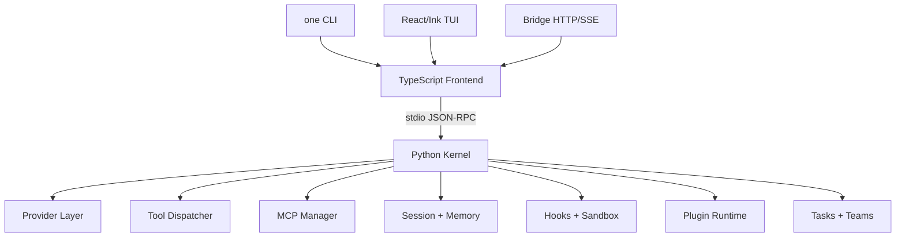

<h1 align="center"><code>one</code> - OneClaw: 开放式编程 Agent Harness</h1>

<p align="center">
  <strong>Python Kernel</strong> ·
  <strong>TypeScript Frontend</strong> ·
  <strong>React/Ink TUI</strong> ·
  <strong>MCP</strong> ·
  <strong>Bridge Control Plane</strong>
</p>

<p align="center">
  <a href="#快速开始"></a>
  <a href="#harness-架构"></a>
  <a href="#核心能力"></a>
  <a href="https://github.com/Lsogod/OneClaw/actions/workflows/ci.yml"></a>
</p>

<p align="center">
  
  
  
  
  
</p>

**OneClaw** 是一个面向编程任务的开放式 Agent Harness。它借鉴 OpenHarness 的优秀分层：把模型 provider、query loop、tools、MCP、hooks、memory、session、sandbox、plugin、bridge、tasks 和 team/swarm 控制面拆成可维护的运行时模块。

当前仓库已经是新的 **OneClaw** 根项目。旧 CLI 历史实现保留在同级目录 `OneClaw-CLI`，本仓库只承载新的 harness runtime。

---

## 核心能力

<table>
<tr>
<td width="20%" valign="top">

<h3>Agent Loop</h3>

<ul>
  <li>流式 provider 事件</li>
  <li>Tool-call 循环</li>
  <li>Session 持久化</li>
  <li>Context compact</li>
  <li>Usage / cost 统计</li>
</ul>

</td>
<td width="20%" valign="top">

<h3>Harness Toolkit</h3>

<ul>
  <li>文件、搜索、编辑、shell</li>
  <li>workspace status</li>
  <li>todo 工具</li>
  <li>MCP tools</li>
  <li>plugin tools</li>
</ul>

</td>
<td width="20%" valign="top">

<h3>Context & Memory</h3>

<ul>
  <li>session memory</li>
  <li>project memory</li>
  <li>global memory</li>
  <li>session export</li>
  <li>context policy</li>
</ul>

</td>
<td width="20%" valign="top">

<h3>Governance</h3>

<ul>
  <li>ask / allow / deny</li>
  <li>path 与 command 约束</li>
  <li>hooks</li>
  <li>budget gate</li>
  <li>sandbox wrapper</li>
</ul>

</td>
<td width="20%" valign="top">

<h3>Swarm & Bridge</h3>

<ul>
  <li>HTTP/SSE bridge</li>
  <li>background tasks</li>
  <li>team registry</li>
  <li>roles / worktrees</li>
  <li>review / merge state</li>
</ul>

</td>
</tr>
</table>

---

## 什么是 Agent Harness

LLM 只负责推理，Harness 负责把推理变成可执行的工程系统。一个完整 harness 至少要提供：

- **手**：工具调用、文件编辑、shell、MCP、plugin tools。
- **眼睛**：workspace 检索、MCP resources、events、status、observability。
- **记忆**：session、project/global memory、history、resume、compact。
- **边界**：permissions、approval、sandbox、budget、hooks。
- **协作**：background task、team registry、worktree、bridge control plane。

OneClaw 的目标是把这些能力整合成一个可运行、可扩展、可跨平台安装的 `one` 命令。

---

## 快速开始

### 本地安装

```bash
bun install
bun run install:local
one --version
```

默认安装位置：

| 平台 | 目标 |
|---|---|
| macOS / Linux | `~/.local/bin/one` |
| Windows | `%LOCALAPPDATA%\Programs\OneClaw\one.cmd` |

也可以指定安装位置：

```bash
ONECLAW_INSTALL_BIN=/usr/local/bin/one bun run install:local
```

### 启动 TUI

```bash
one ui
```

### 单次 prompt

```bash
one -p "分析这个仓库的运行时架构"
```

### 启动 bridge

```bash
one bridge
```

### 本地验证

```bash
bun run ci
```

`ci` 会执行 release check、install smoke、sandbox smoke、TypeScript typecheck、Bun tests 和 Python kernel tests。

---

## Harness 架构



主边界如下：

| 层 | 职责 | 关键位置 |
|---|---|---|
| Python Kernel | provider、query loop、tools、MCP、hooks、memory、sandbox、session | `kernel/oneclaw_kernel/` |
| TS Frontend | CLI、TUI、bridge、command registry、installer、smoke scripts | `src/`, `scripts/`, `bin/` |
| React/Ink TUI | transcript-first UI、modal、approval、bridge panel、MCP panel | `src/tui/` |
| Bridge | HTTP/SSE sessions、requests、tasks、teams、artifacts | `src/bridge/` |

---

## Provider 工作流

OneClaw 把 provider 当成可切换的 workflow/profile，而不是散落的环境变量。

| Workflow | 说明 | 凭据来源 |
|---|---|---|
| `codex-subscription` | Codex / ChatGPT subscription path | `~/.codex/auth.json` |
| `claude-subscription` | Claude subscription path | `~/.claude/.credentials.json` |
| `openai-compatible` | OpenAI 风格 API 和兼容网关 | `baseUrl` + API key |
| `anthropic-compatible` | Anthropic 风格 API，适合 Claude/Kimi/GLM/MiniMax 等兼容网关 | `baseUrl` + API key |
| `github-copilot` | GitHub Copilot OAuth workflow | OneClaw Copilot auth file |

常用命令：

```bash
one providers
one auth status
one auth copilot-login
one setup provider codex-subscription
one smoke --prompt "Reply with only: pong"
```

TUI 内也可以使用：

```text
/provider doctor
/provider test
/provider setup <name>
/profile list
/profile save local-openai openai-compatible gpt-5.4 --base-url http://127.0.0.1:8000/v1 --label "Local OpenAI" --use
/profile show local-openai
/profile delete local-openai
/model <model>
```

Profile 会持久化到 `~/.oneclaw/oneclaw.config.json`，内置 profile 只读，适合保留 OpenHarness 风格的“命名 provider workflow”。

---

## TUI

```bash
one ui
```

OneClaw 的 TUI 按 OpenHarness 的 transcript-first 思路组织，但保留 OneClaw 的 bridge/team 控制面。

| 按键 | 行为 |
|---|---|
| `Ctrl+K` | 打开 command palette |
| `Ctrl+O` | 打开 session picker |
| `Ctrl+T` | 打开 profile picker |
| `Ctrl+B` | 切换 bridge panel |
| `Ctrl+M` | 切换 MCP panel |
| `Esc` | 关闭 modal 或中断运行 |

TUI 当前包含：

- transcript-first 主视图
- permission approval modal
- provider/profile/session picker
- bridge sessions/tasks/teams 面板
- MCP status/tools/resources/templates 浏览
- usage、tokens、cost、events 状态展示

---

## Bridge 控制面

```bash
one bridge
```

Bridge 提供 HTTP/SSE 控制面，用于外部进程、远程 UI 或自动化系统管理 OneClaw runtime。

能力包括：

- session create/query/stream/history/export
- request interrupt/cancel
- artifact export/list/read
- background task launch/cancel/output
- team create/delete/message/run
- team roles/worktrees/review/merge 状态
- token scopes：`read`、`write`、`control`、`admin`

常用 slash commands：

```text
/bridge status
/bridge sessions
/bridge tasks
/bridge requests
/bridge artifacts
/bridge team create <name> [goal]
/bridge team run <name> <goal>
/bridge team role <name> <agent> <role>
/bridge team worktree <name> <agent> <path>
/bridge team review <name> <status> [note]
/bridge team merge <name> <status> [note]
```

---

## MCP 管理

OneClaw 支持 stdio MCP server，并把 MCP tools/resources/resource templates 纳入 kernel 工具目录。

```text
/mcp status
/mcp tools
/mcp resources
/mcp templates
/mcp add <name> <command> [args...]
/mcp remove <server>
/mcp reconnect [server]
/mcp read <server> <uri>
```

TUI 中使用 `Ctrl+M` 可以切换 MCP 面板。

---

## Plugin 与 Skills

Plugin 支持：

- manifest plugin
- JS/TS module plugin
- system prompt patches
- hook definitions
- module hooks
- plugin tools
- install / uninstall / reload / inspect

示例 plugin 位于：

```text
plugins/example.plugin.mjs
```

Skills 与 memory 会进入 prompt assembly，并受 context budget 约束。常用命令：

```text
/plugin
/plugin show <name>
/plugin tools <name>
/plugin hooks <name>
/plugin reload
/hooks files
/hooks add command <event> <name> <command>
/hooks validate
/hooks reload
/skills
/skills search <query>
/skills show <name>
/memory
/memory add <scope> <text>
/memory search <query>
```

---

## Sandbox 与安全边界

OneClaw 的 sandbox 是跨平台策略层：

| 平台 | 策略 |
|---|---|
| macOS | 优先使用 `sandbox-exec` |
| Linux | 优先使用 `bwrap` / Bubblewrap |
| Windows / 其他平台 | 使用外部 wrapper command |

覆盖范围：

- `run_shell`
- command hooks
- MCP stdio server
- JS/TS plugin module runner

如果原生 sandbox 不可用，可以选择 fallback，也可以通过 `sandbox.failIfUnavailable` 让运行时 fail closed。

验证：

```bash
bun run sandbox:smoke
```

---

## 常用命令

| 命令 | 作用 |
|---|---|
| `/help` | 查看命令 |
| `/init` | 初始化项目级 `.oneclaw/` memory 与 hooks 文件 |
| `/status` | 查看 runtime 状态 |
| `/context` | 查看 context 与 compact 信息 |
| `/compact` / `/rewind` | 手动 compact 或回退最近 assistant turn |
| `/cost` / `/usage` | 查看 token 和成本 |
| `/sessions` / `/resume` | 管理 session |
| `/share` / `/tag` / `/copy` | 导出、标记或复制当前会话内容 |
| `/provider` / `/profile` / `/model` | 管理 provider、命名 profile 与模型 |
| `/theme` / `/output-style` | 管理 TUI/CLI 输出偏好 |
| `/keybindings` | 查看或持久化快捷键映射 |
| `/fast` / `/effort` / `/passes` / `/turns` | 管理运行时速度、推理强度和 query loop 上限 |
| `/vim` / `/voice` | 持久化前端输入模式 hint 和 voice keyterms |
| `/continue` | 基于当前 session 继续执行 |
| `/tools` | 查看 tool registry |
| `/todo` | 管理当前 session 的 todo 状态 |
| `/symbols` | 通过 kernel `code_symbols` 索引或搜索代码符号 |
| `/fetch` | 通过 kernel `web_fetch` 读取 HTTP(S) URL |
| `/search-web` | 通过 kernel `web_search` 搜索网页 |
| `/mcp` | 管理 MCP |
| `/plugin` / `/skills` / `/hooks` | 管理 plugin、skills 与 lifecycle hooks |
| `/plan` / `/review` | 运行规划或 review prompt |
| `/tasks` / `/agents` | 管理 task 与 team |
| `/bridge` | 管理 bridge 控制面 |
| `/doctor` / `/doctor bundle` | 环境诊断与诊断包导出 |
| `/privacy-settings` / `/rate-limit-options` | 查看本地隐私边界和限流治理建议 |
| `/feedback` / `/release-notes` / `/upgrade` | 本地反馈、发布说明和源码升级提示 |

---

## 项目结构

```text
OneClaw/
├── bin/one                         # Unix wrapper
├── bin/one.mjs                     # 跨平台 Node launcher
├── kernel/oneclaw_kernel/          # Python kernel
├── src/cli.mts                     # CLI frontend
├── src/tui/                        # React/Ink TUI
├── src/bridge/                     # HTTP/SSE control plane
├── src/commands/                   # frontend slash command registry
├── src/frontend/                   # kernel client
├── src/providers/                  # provider auth helpers
├── src/plugins/                    # plugin installer / module runner
├── src/memory/                     # memory manager
├── src/tasks/                      # task runtime
├── src/agents/                     # team registry
├── tests/                          # Bun tests
├── scripts/                        # install、CI、smoke scripts
├── .github/workflows/ci.yml
├── package.json
└── README.md
```

旧 OneClaw CLI 历史实现保留在同级目录 `OneClaw-CLI`，不属于当前 runtime 项目。

---

## 开发与验证

```bash
bun run typecheck
bun run test
bun run kernel:test
bun run install:smoke
bun run sandbox:smoke
bun run ci
```

CI 当前覆盖：

- macOS / Linux / Windows
- Python 3.10 / 3.11
- TypeScript typecheck
- Bun tests
- Python kernel tests
- launcher smoke
- CLI smoke
- sandbox smoke
- install smoke

---

## 与 OpenHarness 的关系

OneClaw 借鉴了 OpenHarness 中最值得保留的 harness 设计：

- kernel 与 frontend 分离
- provider workflow/profile
- transcript-first TUI
- command registry
- tools/MCP/plugin/skills/memory 分层
- permission、hooks、sandbox、budget 治理
- session/resume/export/compact
- bridge、tasks、team/swarm 控制面

但 OneClaw 不是 OpenHarness 的克隆。它保留了自己的产品目标：

- 主命令固定为 `one`
- 更强调 Codex/Subscription provider 路径
- 更强调 bridge control plane 和 team/task 管理
- 更轻量的仓库结构
- 更直接的跨平台 launcher 与安装 smoke

---

## 当前状态

OneClaw 已经是独立项目，不再是旧仓子目录。当前状态：

- CLI / TUI / Python kernel / bridge 可运行
- 5 个公开 provider workflow
- MCP dynamic add/remove/reconnect/read/templates
- plugin lifecycle
- memory/session 管理
- task/team/swarm 基础生命周期
- sandbox fallback smoke
- macOS/Linux/Windows CI 全绿

后续主要是生态厚度工作：更多 tool、更多 provider 真实 E2E、MCP auth/resource 细节、plugin trust/source policy、LSP/channels/themes/vim/voice 等更完整的平台层。
