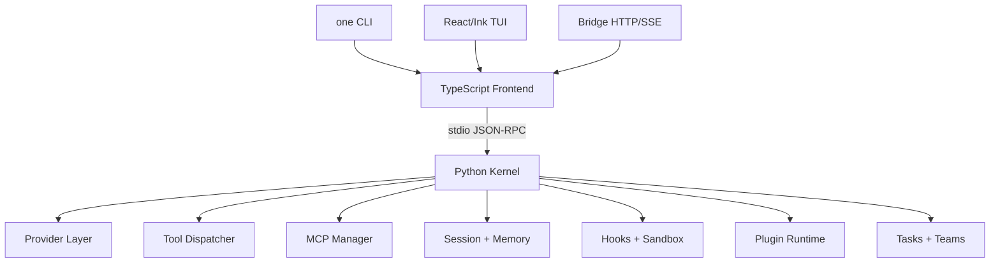

<h1 align="center"><code>one</code> - OneClaw: 开放式编程 Agent Harness</h1>

<p align="center">
  <strong>Python Kernel</strong> ·
  <strong>TypeScript Frontend</strong> ·
  <strong>React/Ink TUI</strong> ·
  <strong>MCP</strong> ·
  <strong>Bridge Control Plane</strong>
</p>

<p align="center">
  <a href="#快速开始"></a>
  <a href="#harness-架构"></a>
  <a href="#核心能力"></a>
  <a href="https://github.com/Lsogod/OneClaw/actions/workflows/ci.yml"></a>
</p>

<p align="center">
  
  
  
  
  
</p>

**OneClaw** 是一个面向编程任务的开放式 Agent Harness。它把模型 provider、query loop、tools、MCP、hooks、memory、session、sandbox、plugin、bridge、tasks 和 team/swarm 控制面拆成可维护的运行时模块。

当前仓库是 **OneClaw** 的正式根项目，承载完整的 harness runtime、TUI、bridge、plugin、MCP 和 swarm 工作流。

---

## 核心能力

<table>
<tr>
<td width="20%" valign="top">

<h3>Agent Loop</h3>

<ul>
  <li>流式 provider 事件</li>
  <li>Tool-call 循环</li>
  <li>Session 持久化</li>
  <li>Context compact</li>
  <li>Usage / cost 统计</li>
</ul>

</td>
<td width="20%" valign="top">

<h3>Harness Toolkit</h3>

<ul>
  <li>44 个内置 kernel tools</li>
  <li>文件、搜索、编辑、shell</li>
  <li>workspace status</li>
  <li>todo 工具</li>
  <li>MCP tools</li>
  <li>plugin tools</li>
</ul>

</td>
<td width="20%" valign="top">

<h3>Context & Memory</h3>

<ul>
  <li>session memory</li>
  <li>project memory</li>
  <li>global memory</li>
  <li>session export</li>
  <li>context policy</li>
</ul>

</td>
<td width="20%" valign="top">

<h3>Governance</h3>

<ul>
  <li>ask / allow / deny</li>
  <li>path 与 command 约束</li>
  <li>hooks</li>
  <li>budget gate</li>
  <li>sandbox wrapper</li>
</ul>

</td>
<td width="20%" valign="top">

<h3>Swarm & Bridge</h3>

<ul>
  <li>HTTP/SSE bridge</li>
  <li>background tasks</li>
  <li>team registry</li>
  <li>roles / worktrees</li>
  <li>review / merge state</li>
</ul>

</td>
</tr>
</table>

---

## 什么是 Agent Harness

LLM 只负责推理，Harness 负责把推理变成可执行的工程系统。一个完整 harness 至少要提供：

- **手**：工具调用、文件编辑、shell、MCP、plugin tools。
- **眼睛**：workspace 检索、MCP resources、events、status、observability。
- **记忆**：session、project/global memory、history、resume、compact。
- **边界**：permissions、approval、sandbox、budget、hooks。
- **协作**：background task、team registry、worktree、bridge control plane。

OneClaw 的目标是把这些能力整合成一个可运行、可扩展、可跨平台安装的 `one` 命令。

---

## 快速开始

### 本地安装

```bash
bun install
bun run install:local
one --version
```

默认安装位置：

| 平台 | 目标 |
|---|---|
| macOS / Linux | `~/.local/bin/one` |
| Windows | `%LOCALAPPDATA%\Programs\OneClaw\one.cmd` |

也可以指定安装位置：

```bash
ONECLAW_INSTALL_BIN=/usr/local/bin/one bun run install:local
```

### 启动 TUI

```bash
one ui
```

### 单次 prompt

```bash
one -p "分析这个仓库的运行时架构"
```

### 启动 bridge

```bash
one bridge
```

### 本地验证

```bash
bun run ci
```

`ci` 会执行 release check、install smoke、sandbox smoke、TypeScript typecheck、Bun tests 和 Python kernel tests。

---

## Harness 架构



主边界如下：

| 层 | 职责 | 关键位置 |
|---|---|---|
| Python Kernel | provider、query loop、tools、MCP、hooks、memory、sandbox、session | `kernel/oneclaw_kernel/` |
| TS Frontend | CLI、TUI、bridge、command registry、installer、smoke scripts | `src/`, `scripts/`, `bin/` |
| React/Ink TUI | transcript-first UI、modal、approval、bridge panel、MCP panel | `src/tui/` |
| Bridge | HTTP/SSE sessions、requests、tasks、teams、artifacts | `src/bridge/` |

---

## Provider 工作流

OneClaw 把 provider 当成可切换的 workflow/profile，而不是散落的环境变量。

| Workflow | 说明 | 凭据来源 |
|---|---|---|
| `codex-subscription` | Codex / ChatGPT subscription path | `~/.codex/auth.json` |
| `claude-subscription` | Claude subscription path | `~/.claude/.credentials.json` |
| `openai-compatible` | OpenAI 风格 API 和兼容网关 | `baseUrl` + API key |
| `anthropic-compatible` | Anthropic 风格 API，适合 Claude/Kimi/GLM/MiniMax 等兼容网关 | `baseUrl` + API key |
| `github-copilot` | GitHub Copilot OAuth workflow | OneClaw Copilot auth file |

常用命令：

```bash
one providers
one auth status
one auth copilot-login
one setup provider codex-subscription
one smoke --prompt "Reply with only: pong"
```

TUI 内也可以使用：

```text
/provider doctor
/provider test
/provider setup <name>
/provider setup-wizard <provider>
/profile list
/profile save local-openai openai-compatible gpt-5.4 --base-url http://127.0.0.1:8000/v1 --label "Local OpenAI" --use
/profile show local-openai
/profile delete local-openai
/model <model>
```

Profile 会持久化到 `~/.oneclaw/oneclaw.config.json`，内置 profile 只读，适合管理多 provider、多模型和本地兼容网关。

`/provider setup-wizard` 和 TUI 中的 provider setup flow 只写入 `kind/model/baseUrl/label/description` 等非密钥字段。API key 不会写入 OneClaw 配置；命令会提示应使用的环境变量，例如 `ONECLAW_API_KEY`、`OPENAI_API_KEY`、`ANTHROPIC_API_KEY`，再调用 provider diagnostics/test 检查连通性。

---

## TUI

```bash
one ui
```

OneClaw 的 TUI 以 transcript 为主轴，并把 provider、MCP、artifact、bridge、team 和 observability 控制面整合到同一个终端界面里。

| 按键 | 行为 |
|---|---|
| `Ctrl+K` | 打开 command palette |
| `Ctrl+O` | 打开 session picker |
| `Ctrl+T` | 打开 profile picker |
| `Ctrl+B` | 切换 bridge panel |
| `Ctrl+M` | 切换 MCP panel |
| `Ctrl+A` | 切换 artifact viewer |
| `Ctrl+G` | 切换 observability panel |
| `/` | 在 artifact viewer 中搜索 artifact |
| `<` / `>` | 在 artifact viewer 中翻页 |
| `Esc` | 关闭 modal 或中断运行 |

TUI 当前包含：

- transcript-first 主视图
- permission approval modal
- provider/profile/session picker
- provider setup wizard，覆盖 compatible API、subscription provider 与 Copilot device flow
- bridge sessions/tasks/teams 面板
- MCP status/tools/resources/templates 浏览、resource detail、template 填参读取、server auth setup、server reconnect
- artifact viewer，用于查看 tool result、swarm summary、session export、diagnostic bundle，支持分页、搜索和 markdown/diff/binary 内容识别
- observability panel，用于查看 usage、token、cost、sandbox 和 recent events
- usage、tokens、cost、events 状态展示
- runtime theme/output-style/keybindings 映射，快捷键提示会读取当前配置并保留默认 fallback

---

## Bridge 控制面

```bash
one bridge
```

Bridge 提供 HTTP/SSE 控制面，用于外部进程、远程 UI 或自动化系统管理 OneClaw runtime。

能力包括：

- session create/query/stream/history/export
- request interrupt/cancel
- artifact export/list/read
- background task launch/cancel/output
- team create/delete/message/run
- team roles/worktrees/review/merge 状态
- token scopes：`read`、`write`、`control`、`admin`

常用 slash commands：

```text
/bridge status
/bridge sessions
/bridge tasks
/bridge requests
/bridge artifacts
/bridge team create <name> [goal]
/bridge team run <name> <goal>
/bridge team role <name> <agent> <role>
/bridge team worktree <name> <agent> <path>
/bridge team review <name> <status> [note]
/bridge team merge <name> <status> [note]
```

本地 swarm 生命周期命令：

```text
/swarm create <name> <goal>
/swarm split <name>
/swarm plan <name> <task 1 :: task 2>
/swarm run <name>
/swarm status <name>
/swarm advance <name> [note]
/swarm artifact <name>
/swarm review <name> <status|auto> [note]
/swarm merge <name> <status|summary> [note]
/swarm diff <name>
/swarm allocate-worktrees <name>
/swarm worktrees <name>
/swarm worktree-flow <name> [check|merge|rebase] [--apply]
```

`/swarm split` 会用当前 provider 把 swarm goal 拆成可执行 subtasks。`/swarm advance` 驱动显式 lifecycle stage：`created -> planned -> running -> reviewing -> ready_to_merge -> merged`。`/swarm allocate-worktrees` 会在仓库外侧创建真实 git worktrees 并绑定到 swarm agents；`/swarm review <name> auto` 会运行 review prompt 并生成 review artifact；`/swarm merge <name> summary` 会运行 merge summary prompt 并生成 merge artifact；`/swarm diff` 会汇总关联 worktree 或当前 workspace 的 git diff/stat。`/swarm worktree-flow` 默认只做 dry-run 检查，只有显式传入 `--apply` 时才执行 merge/rebase。`/swarm review`、`/swarm merge`、`/swarm diff`、`/swarm worktree-flow` 和 `/swarm artifact` 都会把结果写入本地 artifact catalog，方便后续审计、导出或合并总结。

---

## Channels / Gateway

OneClaw 增加了轻量 channel gateway registry，用来把 Slack、Discord、Telegram、Feishu、DingTalk、Matrix、email、webhook 等入口纳入统一控制面。它默认只登记 channel 和 inbox 消息，不把第三方 token 写入 OneClaw 配置；token 通过 `secretEnv` 指向外部环境变量。

```text
/channels list [query]
/channels add <kind> <name> [--label <label>] [--secret-env <ENV>] [--webhook-path <path>] [--delivery-url <url>] [--chat-id <id>]
/channels send <name> <message> [--deliver]
/channels deliver <message-id>
/channels verify <name> <signature> :: <payload>
/channels inbox [query]
/channels ack <message>
/channels show <name>
/channels remove <name>
```

Bridge 也提供对应 HTTP control-plane：

```text
GET    /channels
POST   /channels
GET    /channels/messages
POST   /channels/:name/messages
POST   /channels/:name/deliver
POST   /channels/:name/verify
DELETE /channels/:name
```

`/channels send --deliver` 和 `POST /channels/:name/deliver` 会使用 channel connector 投递 outbound message。当前支持 webhook、Slack、Discord、Telegram、Feishu、DingTalk 的基础 payload 形态；endpoint 可以通过 `metadata.deliveryUrl`、`--delivery-url` 或 `secretEnv` 指向的环境变量提供。`/channels verify` 和 `POST /channels/:name/verify` 支持 HMAC-SHA256 webhook 签名校验。`POST /channels/:name/messages` 可以只记录 inbound message，也可以带 `run: true` 直接启动一个 bridge-managed background task，把 OneClaw 从本地/HTTP bridge 推向多入口 agent gateway。

---

## Artifact Catalog

OneClaw 使用项目级 `.oneclaw/artifacts/` 管理本地 artifact。它用于沉淀 tool result、swarm summary、诊断包和导出的文本结果，不依赖 bridge server。

当前 kernel 内置 `44` 个 tools，覆盖文件/搜索/编辑/shell、LSP、MCP auth/resources、skills、config、brief、sleep、worktree、plan mode、cron、todo、task、agent、team 和 remote trigger。Plugin tools 与 MCP tools 会在运行时动态追加。

```text
/artifacts list [query]
/artifacts show <id-or-name>
/artifacts read <id-or-name>
/artifacts remove <id-or-name>
/artifacts create <kind> <name> :: <content>
/fetch <url> [maxChars] --artifact
/search-web <query> [--limit 1-20] --artifact
/symbols [query] [--path <path>] [--limit 1-1000] --artifact
/lsp workspace|document|definition|references|hover ... --artifact
/lsp status
/lsp test [query] --artifact
/tool-search <query> [--limit 1-100] --artifact
/todo [list|add|pending|start|done|block|remove|clear] --artifact
/sessions export <id> <json|markdown|bundle> --artifact
/doctor bundle
```

`/doctor bundle` 会自动登记诊断 artifact；`/lsp`、`/tool-search`、`/todo`、`/sessions export` 保留原有 stdout 行为，并在显式传入 `--artifact` 时把结果写入 `.oneclaw/artifacts/`。

`/lsp` 默认使用内置 Python AST code-intelligence。需要接入真实 language-server adapter 时，设置：

```bash
export ONECLAW_LSP_COMMAND="your-lsp-adapter --stdio-json"
export ONECLAW_LSP_MODE=persistent
export ONECLAW_LSP_TIMEOUT_MS=8000
export ONECLAW_LSP_STRICT=1
```

外部 adapter 通过 stdin 接收 JSON payload，并在 stdout 返回 JSON result。默认按请求启动 adapter；设置 `ONECLAW_LSP_MODE=persistent` 或 `ONECLAW_LSP_PERSISTENT=1` 后，kernel 会复用一个长期 stdio JSON adapter 进程，并在 shutdown 时清理。未配置或非 strict 失败时会自动回退到内置 Python scanner。

---

## MCP 管理

OneClaw 支持 stdio MCP server，并把 MCP tools/resources/resource templates 纳入 kernel 工具目录。

```text
/mcp status
/mcp tools
/mcp resources
/mcp templates
/mcp capabilities
/mcp browse [server]
/mcp add <name> <command> [args...]
/mcp remove <server>
/mcp auth <server> <env|bearer> <token> [--key ENV_KEY]
/mcp reconnect [server]
/mcp read <server> <uri>
/mcp read-template <server> <uriTemplate> [key=value...]
```

`/mcp auth` 会把 token 写入用户级 OneClaw 配置并在命令输出中脱敏，适合 stdio MCP server 通过环境变量读取认证信息的场景。

TUI 中使用 `Ctrl+M` 可以切换 MCP 面板。资源面板支持选择 server/resource/template、查看 capability detail、执行 reconnect，并用输入 modal 填充 resource template 后读取资源。

---

## Plugin 与 Skills

Plugin 支持：

- manifest plugin
- JS/TS module plugin
- system prompt patches
- hook definitions
- module hooks
- plugin tools
- install / uninstall / reload / inspect / audit
- project/user marketplace catalog

示例 plugin 位于：

```text
plugins/example.plugin.mjs
```

Skills 与 memory 会进入 prompt assembly，并受 context budget 约束。常用命令：

```text
/plugin
/plugin show <name>
/plugin tools <name>
/plugin hooks <name>
/plugin audit <name-or-path>
/plugin trust [list|add <name-or-path>|remove <name-or-path-or-hash>|check <name-or-path>]
/plugin marketplace [list|init|add|remove|show|diff|install]
/plugin marketplace diff <name>
/plugin marketplace install <name> [--dry-run|--trust|--require-trust|--sha256 <hash>|--version <range>|--signature <sig> [--signature-env ENV]]
/plugin reload
/hooks files
/hooks add command <event> <name> <command>
/hooks validate
/hooks reload
/skills
/skills search <query>
/skills show <name>
/skills managed
/skills managed show <name>
/skills init [name]
/skills add <project|user> <name> :: <content>
/skills remove <project|user> <name>
/commands list
/commands show <name>
/commands run <name> [args...]
/commands init [name]
/memory
/memory add <scope> <text>
/memory search <query>
```

`/plugin audit` 会检查 manifest、声明权限、可执行模块、hooks、skills、manifest hash 和安装来源。`/plugin trust` 会记录可信 manifest hash 与来源路径，用于安装前审计和本地插件治理。`/plugin marketplace` 使用项目级 `.oneclaw/plugins/marketplace.json` 和用户级 `~/.oneclaw/plugins/marketplace.json` 管理可安装插件目录。远程 source 会先 clone 到 `~/.oneclaw/plugins/sources/<name>/`，写入 `~/.oneclaw/plugins/marketplace-lock.json`，再执行 audit/install；只有显式传入 `--trust` 才写 trust policy。`--dry-run` 只输出 clone/audit/install/trust 计划，不执行安装；`--require-trust` 会拒绝未信任插件；`--sha256 <hash>` 会强制匹配 manifest hash；`--version` 支持基础 semver 约束；`--signature sha256:<hash>` 或 `--signature hmac-sha256:<digest> --signature-env ENV` 会在安装前验证 manifest 签名。`/plugin marketplace diff` 用于安装前查看 marketplace source 与已安装插件之间的差异。

自定义 command snippets 支持项目级 `.oneclaw/commands/*.md`、用户级 `~/.oneclaw/commands/*.md`、以及 plugin `commands/*.md`。`{{args}}` 会在运行时替换成 `/commands run` 后面的参数。

Managed skills 支持项目级 `skills/*.md` 和用户级 `~/.oneclaw/skills/*.md`。使用 `/skills init` 初始化项目 skill，使用 `/skills add project|user ...` 创建或覆盖 skill；写入后 runtime 会自动 reload，让新 skill 立即进入 prompt assembly。

---

## Sandbox 与安全边界

OneClaw 的 sandbox 是跨平台策略层：

| 平台 | 策略 |
|---|---|
| macOS | 优先使用 `sandbox-exec` |
| Linux | 优先使用 `bwrap` / Bubblewrap |
| Windows / 其他平台 | 使用外部 wrapper command |

覆盖范围：

- `run_shell`
- command hooks
- MCP stdio server
- JS/TS plugin module runner

如果原生 sandbox 不可用，可以选择 fallback，也可以通过 `sandbox.failIfUnavailable` 让运行时 fail closed。

验证：

```bash
bun run sandbox:smoke
```

---

## 常用命令

| 命令 | 作用 |
|---|---|
| `/help` | 查看命令 |
| `/init` | 初始化项目级 `.oneclaw/` memory 与 hooks 文件 |
| `/status` | 查看 runtime 状态 |
| `/context` | 查看 context 与 compact 信息 |
| `/instructions` | 查看或初始化 `ONECLAW.md` / `AGENTS.md` / `CLAUDE.md` 项目指令 |
| `/compact` / `/rewind` | 手动 compact 或回退最近 assistant turn |
| `/cost` / `/usage` | 查看 token 和成本 |
| `/sessions` / `/resume` | 管理 session |
| `/share` / `/tag` / `/copy` | 导出、标记或复制当前会话内容 |
| `/issue` / `/pr_comments` | 管理项目 issue 与 PR review comments 上下文 |
| `/artifacts` | 管理项目级 artifact catalog，支持 tool result 与 swarm summary |
| `/provider` / `/profile` / `/model` | 管理 provider、命名 profile 与模型 |
| `/provider setup-plan` / `/provider setup-wizard` | 输出或执行 provider wizard 风格的配置和修复步骤，不保存 API key |
| `/theme` / `/output-style` | 管理 TUI/CLI 输出偏好，支持 project/user catalog，TUI 会消费当前配置 |
| `/keybindings` | 查看或持久化快捷键映射，TUI 快捷键提示会读取当前配置 |
| `/permissions` | 管理 permission mode、writable roots、command allow/deny 与 path rules |
| `/fast` / `/effort` / `/passes` / `/turns` | 管理运行时速度、推理强度和 query loop 上限 |
| `/vim` / `/voice` | 持久化前端输入模式 hint 和 voice keyterms |
| `/continue` | 基于当前 session 继续执行 |
| `/tools` / `/tool-search` | 查看或搜索 tool registry |
| `/cron` | 管理本地 cron job registry |
| `/todo` | 管理当前 session 的 todo 状态，可用 `--artifact` 沉淀结果 |
| `/symbols` | 通过 kernel `code_symbols` 索引或搜索代码符号，可用 `--artifact` 沉淀结果 |
| `/lsp` | 运行轻量 Python code-intelligence：symbol、definition、references、hover，可用 `--artifact` 沉淀结果 |
| `/fetch` | 通过 kernel `web_fetch` 读取 HTTP(S) URL，可用 `--artifact` 沉淀结果 |
| `/search-web` | 通过 kernel `web_search` 搜索网页，可用 `--artifact` 沉淀结果 |
| `/mcp` | 管理 MCP，包括 server、resource、template、auth、browser、template read |
| `/plugin` / `/skills` / `/hooks` | 管理 plugin、skills 与 lifecycle hooks |
| `/plan` / `/review` | 运行规划或 review prompt |
| `/tasks` / `/agents` / `/swarm` | 管理 task、team 与 plan-driven swarm 生命周期 |
| `/bridge` | 管理 bridge 控制面 |
| `/channels` | 管理 Slack/Discord/Telegram/Feishu/webhook 等 channel gateway registry 与 inbox |
| `/observability` | 查看 trace、failure、usage 运行时观测摘要；TUI 可用 `Ctrl+G` 打开观测面板 |
| `/doctor` / `/doctor bundle` | 环境诊断与诊断包导出 |
| `/privacy-settings` / `/rate-limit-options` | 查看本地隐私边界和限流治理建议 |
| `/feedback` / `/release-notes` / `/upgrade` | 本地反馈、发布说明和源码升级提示 |

---

## 项目结构

```text
OneClaw/
├── bin/one                         # Unix wrapper
├── bin/one.mjs                     # 跨平台 Node launcher
├── kernel/oneclaw_kernel/          # Python kernel
├── src/cli.mts                     # CLI frontend
├── src/tui/                        # React/Ink TUI
├── src/bridge/                     # HTTP/SSE control plane
├── src/channels/                   # channel gateway registry
├── src/commands/                   # frontend slash command registry
├── src/frontend/                   # kernel client
├── src/artifacts/                  # project artifact catalog
├── src/providers/                  # provider auth helpers
├── src/plugins/                    # plugin installer / module runner
├── src/memory/                     # memory manager
├── src/tasks/                      # task runtime
├── src/agents/                     # team registry
├── tests/                          # Bun tests
├── scripts/                        # install、CI、smoke scripts
├── .github/workflows/ci.yml
├── package.json
└── README.md
```

## 开发与验证

```bash
bun run typecheck
bun run test
bun run kernel:test
bun run install:smoke
bun run sandbox:smoke
bun run ci
```

CI 当前覆盖：

- macOS / Linux / Windows
- Python 3.10 / 3.11
- TypeScript typecheck
- Bun tests
- Python kernel tests
- launcher smoke
- CLI smoke
- sandbox smoke
- install smoke

---

## 设计原则

- kernel 与 frontend 分离
- provider workflow/profile
- transcript-first TUI
- command registry
- tools/MCP/plugin/skills/memory 分层
- channels/gateway registry 与 bridge channel endpoints
- `CLAUDE.md` / `AGENTS.md` / `ONECLAW.md` 项目指令发现与 prompt 注入
- custom themes 与 output styles：`.oneclaw/themes/*.json`、`.oneclaw/output_styles/*.md`、`~/.oneclaw/themes/*.json`、`~/.oneclaw/output_styles/*.md`
- tool discovery 与本地 cron job registry
- lightweight LSP/code-intelligence 入口与可选外部 LSP adapter
- permission、hooks、sandbox、budget 治理
- session/resume/export/compact
- bridge、tasks、team/swarm 控制面

---

## 当前状态

OneClaw 当前状态：

- CLI / TUI / Python kernel / bridge 可运行
- 5 个公开 provider workflow
- provider setup wizard，密钥仅通过 env/subscription/Copilot auth flow 处理
- MCP dynamic add/remove/reconnect/read/templates/auth/browser，TUI 支持 MCP auth setup modal
- channels/gateway registry，支持 inbox、ack 和 bridge-managed task 触发
- plugin lifecycle、marketplace、audit、trust、remote source lockfile、version/signature policy、install-before diff
- tool search、本地 cron registry 与项目级 artifact catalog
- lightweight Python LSP/code-intelligence 与可选外部 LSP adapter
- project instruction discovery：`ONECLAW.md`、`AGENTS.md`、`CLAUDE.md`、`.claude/rules/*.md`
- theme/output-style catalog loading：project/user/builtin，TUI 会消费当前 theme/keybindings
- memory/session 管理
- task/team/swarm 基础生命周期，包含 split/review-auto/merge-summary/diff/worktree-flow artifacts
- kernel tool surface：44 个内置 tools，并支持 plugin/MCP 动态扩展
- sandbox fallback smoke
- macOS/Linux/Windows CI 全绿

后续主要是生态厚度工作：更多 provider 真实 E2E、更复杂的 MCP resource 场景、真实 IM gateway adapter，以及更完整的 vim/voice 子系统。
